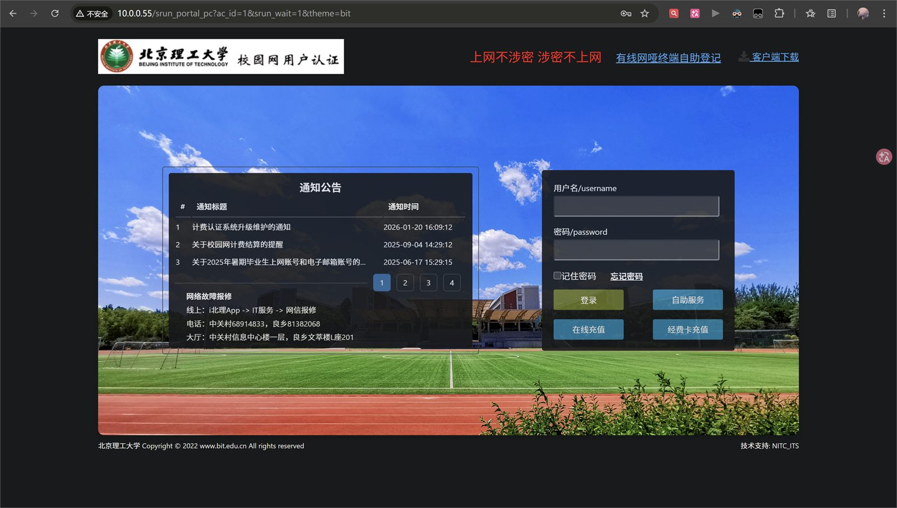
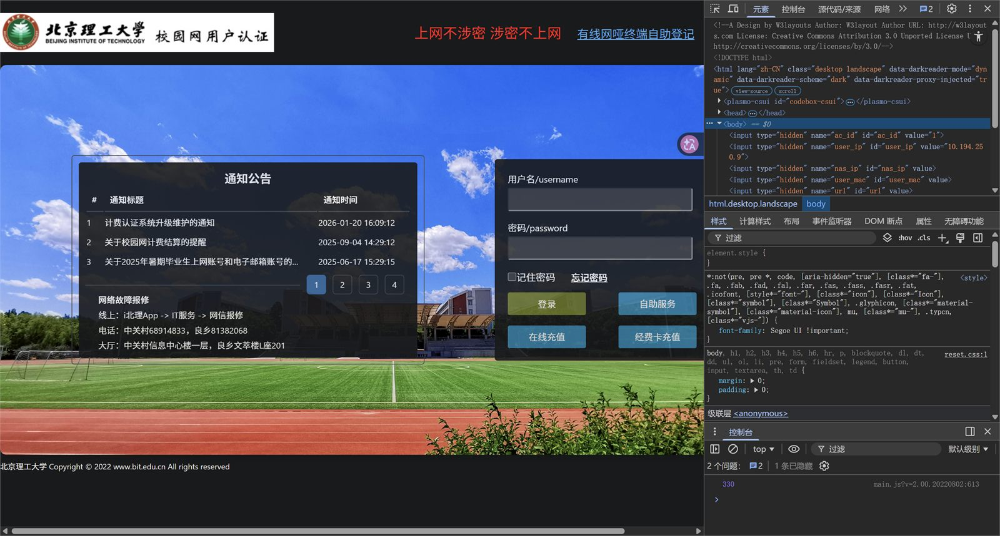
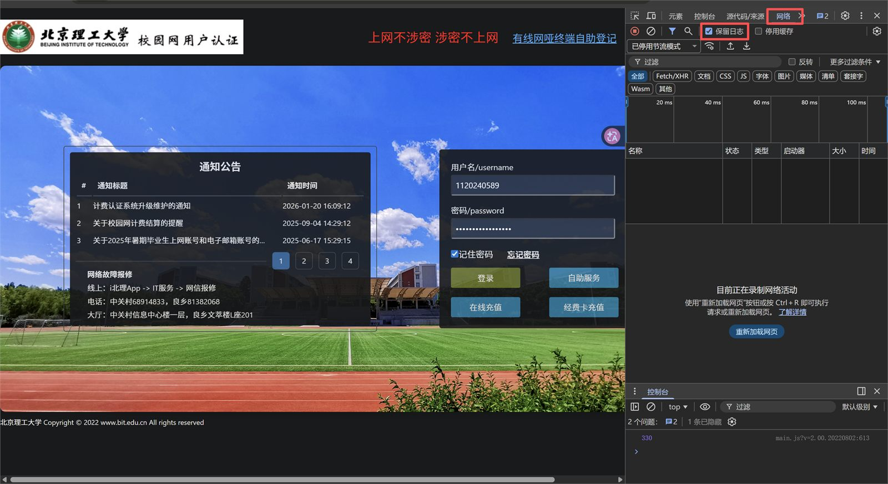
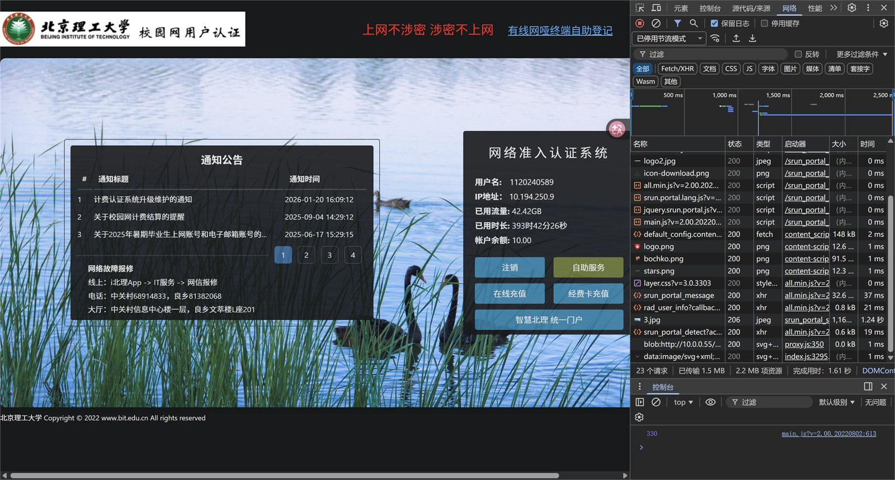
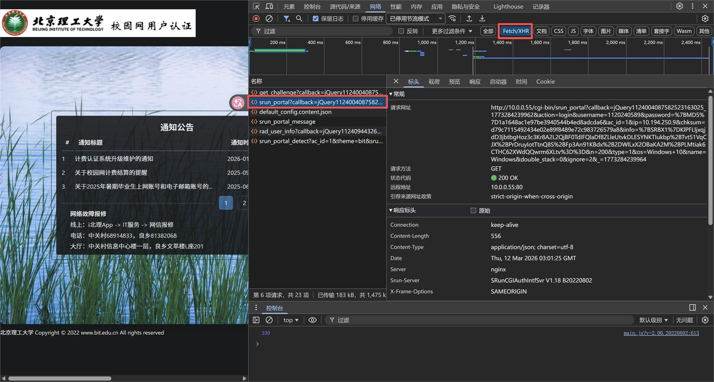
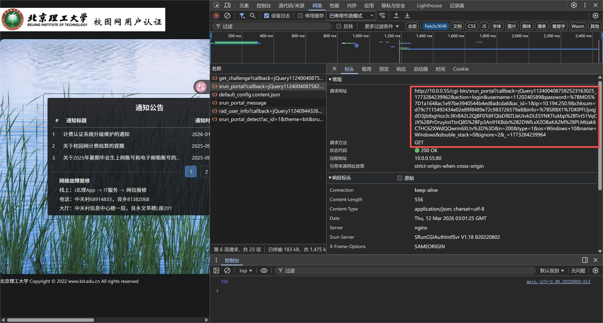
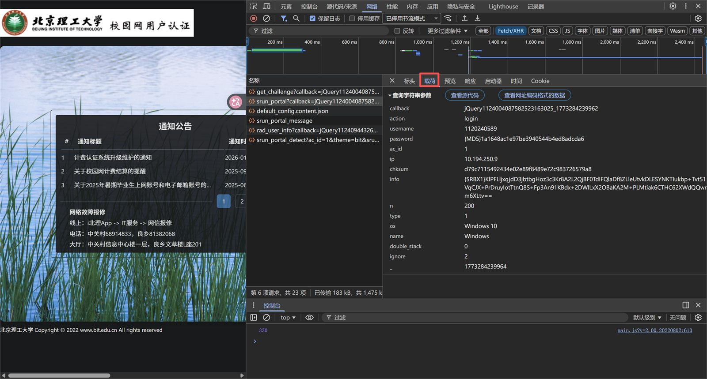

## 📄 yaml 文件配置

> 本教程面向新手，如果对相关概念非常熟悉请跳过。
> 如果仍有问题，可以利用 AI 撰写配置文件，注意**不要上传个人密码并做好文件备份**。

### 创建配置文件

首先新建一个配置文件【Config.yaml】
如果是 Windows 中，双击运行 bitsrun.exe 可以自动创建 yaml 文件。
如果是 docker，则需要配置文件挂载至 `/data/Config.yaml`

``` yaml
form:
  domain: www.msftconnecttest.com #登录地址 ip 或域名
  username: "" #账号
  user_type: cmcc #运营商类型，详情看下方文字说明
  password: "" #密码
meta: #登录参数
  "n": "200"
  type: "1"
  acid: "5"
  enc: srun_bx1 # enc 不在表单中，但一般都是默认值。你可以使用 --auto-enc 或在 js 中搜索 enc 来找到真实值
  os: Windows 10
  name: windows
  info_prefix: SRBX1 # info 字段前缀括号中的值
  double_stack: false
settings:
  basic: #基础设置
    https: false #访问校园网 API 时使用 https 协议
    skip_cert_verify: false #跳过证书有效校验
    timeout: 5 #网络请求超时时间（秒，正整数）
    interfaces: "" #网卡名称正则（注意转义），如：eth0\.[2-3]，不为空时为多网卡模式
    interfaces_interval: 0 # 秒，多网卡模式切换网卡时触发的等待时间
  guardian: #守护模式（后台常驻）
    enable: false
    duration: 300 #网络检查周期（秒，正整数）
  backoff: # 积分退避
    enable: false # 开启后同时对所有运行模式生效，作用于登录失败的重试
    max_retries: 0 # 为 0 时无限重试直至成功
    initial_duration: 2 # 初始失败等待时间，秒
    max_duration: 300 # 最大失败等待时间，秒
    # 等待时间计算公式详见 https://github.com/Mmx233/BackoffCli
    exponent_factor: 1 # 指数因子
    inter_const_factor: 0 # 内常数因子，秒
    outer_const_factor: 0 # 外常数因子，秒
  log:
    debug_level: false #打印调试日志
    write_file: false #写日志文件
    log_path: ./ #日志文件存放目录路径
    log_name: "" #指定日志文件名
  ddns: #校园网内网 ip ddns
    enable: false
    domain: www.example.com
    ttl: 600
    provider: "cloudflare"
    config: #这段配置是动态的，需要根据 provider 类型配置字段名，见 DDNS 说明
      zone: "xxxx"
      token: "xxxx"
  reality: #从指定地址模拟浏览器行为进入登录页，如果登录未出现问题不用启用
    enable: false
    addr: http://www.baidu.com #初始地址，需要使用 http、域名
  custom_header: #这段配置是动态的，用于设置请求头，可以自由填写
    User-Agent: Mozilla/5.0 (Windows NT 10.0; Win64; x64; rv:89.0) Gecko/20100101 Firefox/89.0
```

### 填写配置

先设置以下参数

``` yaml
form:
  domain: 10.0.0.55 # 校园网的登录ip
  username: "1120XXXXXX" # 学号
  user_type:  # 对于校园网，这里应该留空
  password: "passward" # 填写你的校园网账号密码
```

### 抓包获取更多参数

这些参数需要抓包获取

``` yaml
meta: #登录参数
  "n": "200"
  type: "1"
  acid: "5"
  enc: srun_bx1 # 一般默认值就可以
  os: Windows 10
  name: windows
  info_prefix: SRBX1 # info 字段前缀括号中的值
  double_stack: false # 这个也不用改
```

1. 访问10.0.0.55，填入用户名和密码


2. 按下【F12】，打开【开发者模式】


3. 选择【网络】，并勾选【保留日志】


4. 按下【登录】


5. 选择【Fetch/XHR】进行筛选，找到【srun_portal?........】的请求


6. 找到各个参数对应的值

可以从图中一大坨里找，也可以从下方【载荷】里找


### 其他参数

对于新手，以下两个参数可以打开

``` yaml
settings:
  guardian: #守护模式（后台常驻）
    enable: true  # 可以打开，以提高稳定性
    duration: 300 #网络检查周期（秒，正整数）

  log:
    debug_level: true #打印调试日志，方便检查问题
    write_file: false #写日志文件
    log_path: ./ #日志文件存放目录路径
    log_name: "" #指定日志文件名
```

